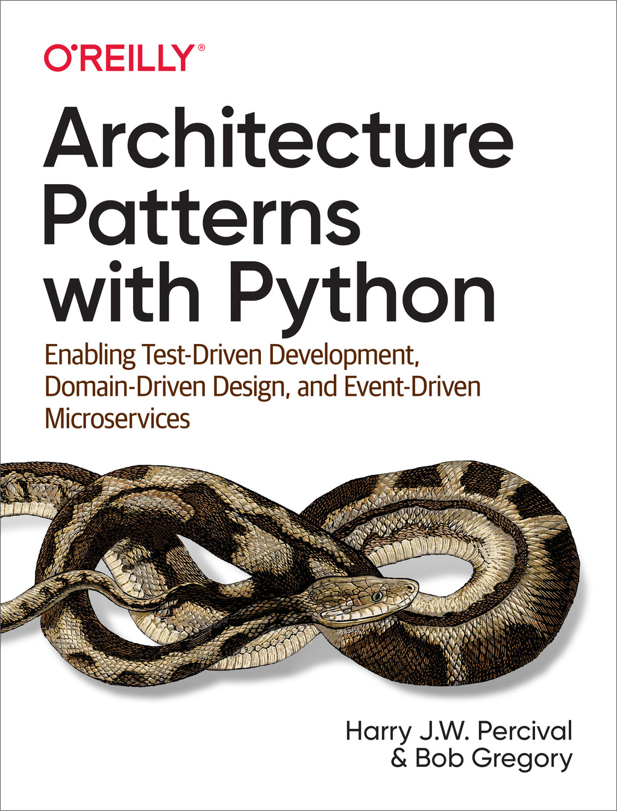
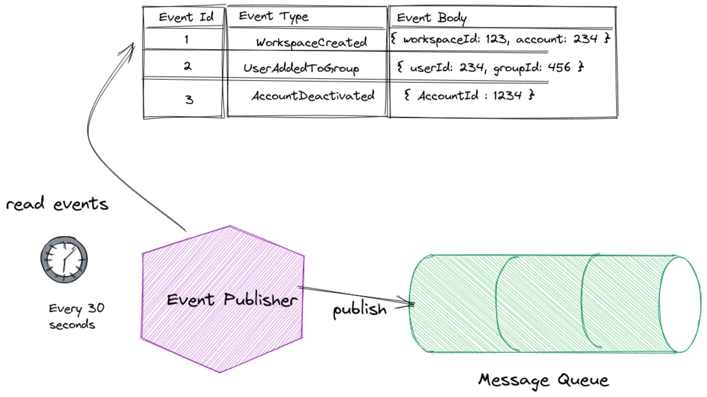
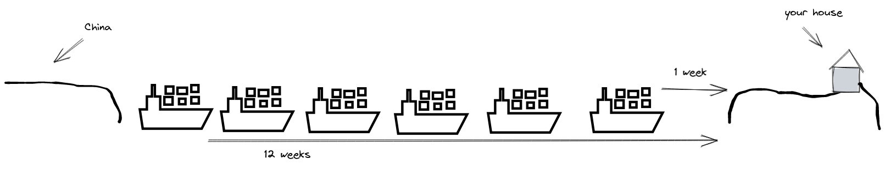
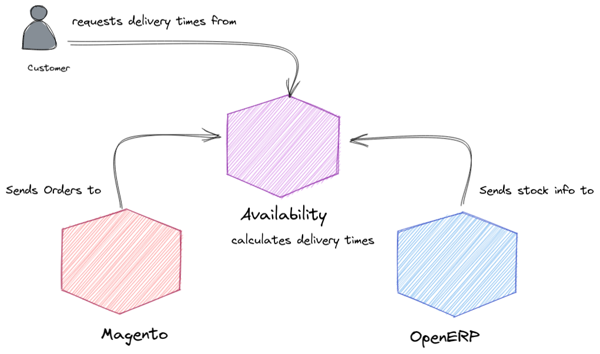

# Breaking up (with) the monolith

---
## Who am I?


I'm Bob - husband, dad, and software architect, currently working for Cazoo.

Notes: This is me, I'm Bob. This picture was drawn by my son. Disturbingly, at some point he'd crossed out the word "mummy" and replaced it with "daddy". I presume it was the beard.

--
### Who am I?

Me and my mate Harry done a book!



You can read it for nowt at [CosmicPython.com](https://www.cosmicpython.com/) 

Notes: It's obligatory for me to promote the book that I wrote with Harry. You can read that on the internets, you don't have to pay any money or anything, but it talks a lot more about some of the things we'll discuss today.

--
### Fight me

- Twitter: @bob_the_mighty
- Github : github.com/bobthemighty

Notes: If you read the book or watch the talk and you want to fight with me, or give me money, then you can find me on Twitter, or on Github. I usually upload my talks as markdown documents into Github, but I need to speak to Hotjar and work out if they'll let me do that this time.

---
## What am I going on about?

- Why do we want to break up a monolith?
- What are systems and services?
- Three successful strategies for break-ups
- Wrap up

Notes: So, all that said - today I want to talk about how and to break down a monolith. So we're going to see why you might want to do that - what problems do we get with a large codebase - then we'll see why a service-oriented approach solves some of those problems, and then I'm going to tell you 3 war stories about monolith decomposition projects. The team lead for your Developer Experience team actually wrote two of these systems with me, so you could have saved yourselves some effort and just asked Fra, but I am delighted to be here with you nonetheless.

---

## Questions?


Notes: Quick note on questions - if I say somethign and you don't understand the words that come out of my mouth, then please interrupt. Please don't sit there for the rest of the talk if you don't understand the word "monolith" because then you're wasting your time and mine.

If I say something and you want to fight with me, or you want more information, then plesae wait until the end, because otherwise I'll get distracted and we'll never finish this thing.

---
# Why break apart a monolith?

Note: It's taken as read that we want to break apart a monolithic application. Big pieces of software have a bad reputation these days. In order to talk about how to break things up, we need to have some understanding of what we're trying to achieve. Monoliths aren't *all* bad.

--
## Why break apart a monolith?

Monoliths are _globally simple_. 

Monoliths are often _locally complex_

Note: When we're building software, we have to deal with complexity. That's more or less the whole job. Writing code is *easy*. Github managed to teach an AI to do it. The real art of software engineering is learning to deal with the explosion of complexity that comes as your system gets larger.
In a monolith, we have one big blob of stuff. That means you only have one thing to deploy, one thing to monitor, one thing to maintain. You probably have one place where you need to apply use authentication, one place where you capture logs and so on. 
The trade-off is that internally, monoliths can grow very complex and, over time, that can cause us problems.

---
## Systems are complex

We're in the business of building _systems_


[Kozuch](https://commons.wikimedia.org/wiki/File:Prim_clockwork.jpg), [CC BY-SA 3.0](https://creativecommons.org/licenses/by-sa/3.0), via Wikimedia commons

Note: Software engineers build systems. A system is a set of things working together where the overall behaviour _emerges_ from the interactions of parts. A watch is a great example of a complex thing. there are lots of small parts - that are locally simple - but the behaviour is globally complex.

--
### Systems are complex


System behaviour is _emergent_

Note: Neural networks, in the machine learning sense, are another great example. In a neural network, you have a bunch of functions, and each function is very simple, but by connecting them together so that they can interact, we can simulate complex adaptive behaviours

--
### Systems are complex


Each part affects the others, and no part can be easily removed or changed.

[Mikael Häggström](https://commons.wikimedia.org/wiki/File:Adult_male_with_organs.png), CC0, via Wikimedia Commons

Note: Your body is a third great example of a complex system. If your brain stops working, the system stops pretty much immediately, but if any part of your body goes wrong, it will have a global impact eventually. If your organ of balance goes awry, you won't be able to walk, you'll get less exercise, your muscles will waste away, you'll be more likely to gain weight. Your ears can affect your heart, your liver, your pancreas, because you are a system.

---
### Reasons for breaking apart a monolith

Note: in my experience there are common reasons why people start to talk seriously about "breaking up a monolith"

--
### Reasons for breaking up

<dl>
<dt>Performance</dt>
<dd>As the system gets bigger, it's harder to optimise</dd>

<dt>Development Velocity</dt>
<dd>As the system gets bigger, it takes longer to release</dd>

<dt>Risk</dt>
<dd> As the system gets bigger, the changes get scarier</dd>
</dl>

Note: Performance, as the system gets bigger, the parts interact in ways that make the system slower or that make it harder to optimise. It's often hard to optimise one part because it's re-using some code or infrastructure that has to work for many other parts. 
Velocity: as the system gets bigger, it take sus longer to build and test it. That slows down our release cycle. As the release cycle slows, we end up releasing bigger chunks of work together and that increases
Risk: because all the parts can affect each other, and because we do larger, less frequent releases, we increase the likelihood of unanticipated changes - bugs - emerging from the interactions.

These problems are exacerbated by growing teams. As the team gets bigger, they want to make more and more changes concurrently to the codebase, and that means they're more likely to trip over each other. This is just a special case of the velocity and risk problems.

---
# What are services?

--
### Services

- A set of _components_
- that _collaborate_ to
- support a _business capability_
- exposed via a _contract_

--
#### Services are systems


Note: A service is a set of components, so databases, apis, cron jobs, whatever that work together to support some business capability. A business capability is a thing that your company does, like billing, or gathering analytics, or delivering cars.
In other words, a service is a _system_. Each of these three components is working with the others, and they're unable to do their job if you take one of them away. If we take away the API, nobody can use our system any more. If we take away the database, the other two pieces will just fail, and if we take away our cron worker, maybe the database will fill up with junk, or we'll fail to produce some nightly reports or something.
We can see, then, that these components are tightly coupled. If I deploy one of them, I should probably deploy the others, because otherwise I might break the db schema and my api will stop working.

--
#### Services expose contracts


Note: But the service as a whole is autonomous, because it exposes a _contract_. The contract says "if you call this api, or put a message on this queue, or whatever, I'll do this job and return this data". And you don't need to know any of the details about how it does that. The components are hidden from you, the consumer, because they're behind the contract. 
All you have is the service documentation to tell you how to invoke the service through the contract.

--
#### Services are autonomous


Notes: That means that I can change all the components inside this box, so long as the contract here remains the same. This is how we decompose the system into multiple autonomous parts. We constrain the interactions between components, so that effectively group the graph into tightly coupled regions inside the boxes and loosely coupled regions between the boxes.

--
#### Services align to business capability


Note: You can take things out of a monolith that are infrastructural pieces - let's say you want to extract a notifications service that sends emails or something, that's an infrastructural service. you can pull out these functionality isolated parts pretty easily, and then you gain some of the benefits. The only problem with that is that you still have all your business logic in one place, and *that* is the stuff that you need to be able to change quickly. It's ironic that the things you *most need* to have in separate services are the things that are hardest to extract.
For the purposes of this talk, I'm looking at how to extract those meatier chunks of your system.

---
# Why do services help?
--
<dl>
<dt>Performance</dt>
<dd>We can optimise and scale each service individually.</dd>

<dt>Development Velocity</dt>
<dd>We can work on the pieces in parallel and deploy them in isolation.</dd>

<dt>Risk</dt>
<dd>Smaller codebases are easier to change. Services can fail individually.</dd>
</dl>

Note: So when we break things up, we can then look at the performance of each thing individually, and we can make changes that are optimal for the smaller set of concerns. Moreover, we often find that services have different scaling needs. Breaking things apart into these distinct parts means we can scale them individually. Having a clear contract between services means we can have separate teams working on services and deploying them without needing to coordinate. Because we're changing a smaller number of things, and making smaller deployments, that reduces our risk - we're better able to make deep changes.

---
# How?
--

### tl;dr

1. Separate data
2. Separate logic
3. Separate UI

(in any order)

Note: Classically when we talk about software, we think of it in layers: the data
access layer, the business logic layer, and the presentation layer. This is a
bit simplistic and old-fashioned because a modern system might have a very
complex front-end application, backed by a very dumb backend, but its helpful
for our purposes today.
When you're thinking about how to break apart a monolith, you need to think
about how you'll separate the data, the presentation, and the model.


--

### tl;dr

Use async messaging

Note: I don't know of any sane way to extract a service out of a monolith that doesn't involve keeping two things in sync, and the best way to do that - in my not so humble opinion - is asynchronous messaging. I'm going to talk through 3 examples of times I've done this, in a variety of programming languages and contexts, but messaging was key to each project.

In each of the three examples, I'm going to explain a little bit about the system to give the context for why we wanted to move it out of a monolithic system, and I'll give you a quick guide to _how_ we did it. At the end of this talk, hopefully, you'll have some new ideas about how to tackle breaking things up if you encounter these problems in your own organisations.

---
# The .Net Banyan Tree <!-- .element: class="frosted" -->
<!-- .slide: data-background="./static/img/banyan.jpg" -->

Note: The first system I want to talk about is the one we talk about at the end of the book. It was a .Net monolith that I worked on at a company called Huddle. This system was originally built by a consultancy, and they'd actually done a pretty good job, but they'd taken advantage of features in .Net that make it easy to build something quickly at the cost of maintainability.

--
## Users, workspaces, documents


Note: Huddle is a tool for collaborating with people. The idea is that you create these workspaces, and then you invite people into them. Inside a workspace, you can share documents, and create tasks, and so on. It's like a project management tool, focused on collaboratively authoring content.

--
## Complex Permissions model


Note: The business logic for Huddle allowed for relatively complex permissions based
on the Linux file system permissions model. Users belonged to Groups, and those
Groups were granted permissions on SecureObjects. SecureObjects had a parent, and
permissions would cascade down the tree. The owner of a SecureObject had special
privileges on it.

--
## Rich object hierarchy


Note: The model was conceptually clear but had a high degree of intradependence. A
Workspace is a SecureObject and contains Folders which are SecureObjects. A
Workspace's parent is an Account, which is a SecureObject, and which is owned by
a User, also a secureObject. Folders contain VersionableItems, which are
SecureOjects, and those Versionables contain Versions, also secureobjects.
The system used an ORM, an object-relational mapper, called NHibernate, and each
of these links on the diagram was traversable in code.

--
## Dense object-graph


Note: For example, I could look
at a Document, and find the list of users who were set to approve that document,
and then for each user, I could fetch their account, and then enumerate the
workspace in those accounts and list the tasks in those workspaces.
The object graph was dense in terms of the links between things.

--
Problems

- Terrible performance
- Mindbending complexity
- Hard to change

Note: This led to two big problems, one was that the ORM would generate horrible
queries. Each of these things, Folders, Users, Documents, Tasks,
WhiteboardVersions etc had its own table in the database, but they all had
foreign keys back to SecureObject and Versionable and so on.
IF you have an arbitrary SecureObject, you have to look in all these tables
to see what kind of secureobject it is.
And the model made it easy to accidentally write slow code. Being able to say
"user.workspaces[0].documents.forEach(d => d.delete())"
made it easy for an engineer to inadvertently generate these monstrous queries
in a loop and cause horrible database performance.
The second major problem is that because Documents shared so much of their code
with Tasks or Users it was hard to change things. Any change to improve
the performance of one part would have impacted the whole system.
So you can see how this is exactly the problem we talked about - in a system,
each part affects the others, and that can lead to unintended consequences.

--
<!-- .slide: data-background="./static/img/banyan.jpg" -->

Notes: Banyan Tree
We tried a bunch of things to solve this problem. We introduced a repository
pattern, and started doing dependency injection, and wrote command classes and
all kinds of junk, but we really just layered these new ideas onto the existing
mess. As a result, the system because bigger and more complex. Logic was
duplicated in multiple places. Maybe I had a DocumentManager, and a
DocumentService, and a MarkDocumentApproved command, and all of them let you
approve a document, but each was written in a different way and replicated the
same behaviour. It was a big mess.

Eventually we founkd an architect who knew what he was doing and he described
this as a Banyan Tree architecture. I've never heard the term anywhere else so
I suspect he made it up BUT

The Banyan tree is a kind of fig. Birds eat the seeds and they poop them out
of the sky. Sometimes those seeds fall on the branches of a tree and they
start to grow. They put down these long roots from the branches of the tree
down to the ground, and then they start to grow around the host tree.

Ovre time, the Banyan plant puts out its own branches, and those branches have
roots, too. Eventually the host tree is completely surrounded by the parasitic
plant.

Likewise, we had tried to solve our problem by layering more and more complexity
on top of the old codebase, like a banyan, enveloping the old mess but note
tackling it.

---
<!-- .slide: data-background="./static/img/snowflakes.jpg" -->
Not every part of your system is special <!-- .element: class="frosted light" -->

Notes: The first part of fixing this problem, with a big horrible codebase,
is to understand that not all of your code is important. Not all of your code
can be beautiful. Some of it is going to be crap, because you're in a hurry and
you only have limited attention.

What you need to do is work out which parts of your system are most important
to the business, and focus on extracting and solidifying those. To do that we
used an exercise called the Product alignment matrix, which looks like this:

--
## Finding the core domain


Notes: We talked about all the things that Huddle did: tasks, login, files, monthly
billing and so on. We mapped them out in this grid. The X axis is criticality.
The critical things are stuff that you have to do, or you don't have a business.
At one end of that spectrum is login. If your users can't log
in, then they can't use your system. Game over. In the middle of this quadrant
is card payments. If customers can't pay you, you don't have a business. For
Huddle,  because it's a monthly billing cycle, we could probably wait a few days
before fixing the billing system, but if you're an e-commerce business, then
payments is super critical and needs to be fixed within minutes, so these things
are entirely contextual.

Over here on the left is the Facebook app we built, that nobody used, and was
buggy and terrible. If that stopped working, nobody would notice at all.

The Y axis is differentiation. Things that are high on this axis make us
different from our competitors. If you sold your software in a box, which things
would you put on the packaging? It's unlikely that you'd put "logins" or
"payments" on there, because those things are boring. You might put "facebook
app" on there, because most file collaboration systems don't work with Facebook,
probably for a very good reason.

So things in the bottom right are critical but boring. Payments, log in, that
kind of thing. Those things you should try and buy off the shelf if you can.
Use Stripe. Use Auth0. Don't build your own billing system, it's a waste of your
time.

Stuff in the top-left is fluff. You should get a consultancy to build those.
Have a Facebook app by all means, but don't spend lots of time on it because
it's not contributing to your business really, except for marketing purposes.

Bottom-left is stuff that's not critical _or_ differentiating. You should stop
doing these things, because they're not helping you at all. These are the boring
features that your customers don't even use. Just delete them.

Top-right is the stuff that is BOTH differentiating and core. This is where you
should pay your attention. The things in _this_ box *have* to be good. This is
your core domain. This is the proposition you make to customers, it's the thing
that you want to do better than anyone else in the world.

For Huddle, this was Document collaboration.
We wanted to be able to innovate on the problem of document collaboration
without having to care about monthly billing cycles or whiteboard versions or
any of the other stuff that we'd put in the system. To do that, we wanted to
separate documents out into its own service.

---
<!-- .slide: data-background="./static/img/shattered-glass-window-1490304513ROy.jpg" -->
# Strategy: Smash and Grab <!-- .element: class="frosted light" -->

Notes: We used a strategy that I'm calling Smash and Grab. Think of architecture like
planning a robbery on a jewellery store. Usually, you want to use a stealth
approach. You patiently work around the edges, you become an employee at the
jewellery store. You befriend the boss, you learn where all the security cameras
are and the procedures for locking up the shop and then - one night - under
cover of darkness, you slip in and out like a ghost.

The other way to rob a jewellery store is to walk in with a crowbar in broad
daylight, smash all the glass display cases, grab the most expensive stuff you
can fit in your pockets and RUN.

And that's what we did. metaphorically.

--
<!-- .slide: class="single-image columnar" -->
We want to move from this...


Notes: So the plan is, we have this single blob of code talking to a database, and we have to deploy it all together and we want to _Somehow_ get to 

--
<!-- .slide: class="single-image columnar" -->
#### Smash and Grab


To this...

Notes: This, where we have two databases, and two web applications, and two APIs and so on. How do you do this? If you have thie problem with horrible complexity and poor performance, and you want to extract part of your code, but it's all tangled up and interdependent, what's the magic trick?

--


Notes: The basic technique to do this is copy and paste. Step 1 is that we literally
took a copy of the database and a copy of the source code. I fired up a new
version of the application on my laptop, and then we started deleting code. 

--
#### Remove the unused code


Notes: We'd got acceptance tests that talked to the documents api, so after every change I'd
run those tests. If the tests failed, I undid my change and deleted a smaller
bit of code. If the tests passed, I committed and then went and deleted
something else.

This part was really therapeutic. It's quite easy to delete 60% of the codebase,
and most of the database tables, without changing any of the behaviour or doing
much refactoring.

It's important to remember that in this step we're not changing the documents
code itself, we're just pruning all the things around it.

--
#### Use messaging to replicate data


Notes: Messaging for data replication (two systems, messages flow between)
The next step is that we need to keep our two systems in sync. When a workspace
is deleted over here, we need to make a note of that over here in our documents
service. When I try to access a document that's in a deleted workspace, I should get
an error.

--
#### Why messaging, not API calls?


Notes: Naively, you might do this through API integration. When someone requests document
123, we could look in our database to see that document 123 is in workspace 234, and
then make a request to the workspaces API to check the state of that workspace.

--
#### Synchronous calls propagate failure


Notes: There are two problems here. Firstly, if this workspaces API is running slowly,
or has an outage, then my Documents API will _also_ misbehave. By coupling these
two things at runtime, we reduce our reliability.

--
#### The more calls you make, the worse your reliability


Notes: The second problem is that in order to figure out if you can access a file, we
need to know which groups you belong to, and whether the account that owns the
workspace is locked, and whether you're a workspace admin, and a bunch of other
things. If you go with an API-driven approach, then you need to be able to make
queries against all these endpoints before you can serve the document, and you
can see how this quickly reduces performance and reliability.

--
#### Looks familiar...


Avoid the distributed monolith!

Notes: In fact, if you go this route, you'll quickly find that you're reproducing this
exact design again, but with a slow and unreliable network connection instead of
in-memory function calls. that's not an improvement.
--
#### Cache data locally to avoid synchronous calls


Notes: Instead, we want to cache the data locally, so that we can always return an
answer quickly.
The way we did that is through messaging. The original system raised events that
described changes we cared about, and our new system subscribed to those events
so that we could make changes to our local domain model.

For example, when a Workspace was created over here, we could create a matching
workspace over here, that just has two fields - workspace id and "active".

If a workspace is deleted over here, we can find the record over here and set
active to false. If the account is locked over here, or the user who owns the
workspace is banned, we can make the same change over here - find the affected
workspace and make it inactive.

Over here in the original system, the workspace is a complex object that
contains hundreds of things, but on this side we can reduce that complexity down
to a single boolean - should I serve documents from this workspace or not -
because that's the only thing we care about.

This is a really important idea. You can have many representations of the same
concept, document, workspace, user etc. Each service might have its own view of
that concept, and they're tied together by a shared identifier.

I don't need to reach out to a workspace api every time I want to know about a
workspace. I can keep my own, eventually consistent, view of workspaces in my
local database.

--
#### Instrumenting the code with events

```csharp
class UserManager 
{
   public static void AddUserToGroup(User user, int groupId)
   {
       using (var tx = UnitOfWorkManager.Start()) {

           Group g = GroupManager.GetGroupById(groupId);
           g.Members.Add(user);
           Events.add(new MemberAddedEvent(groupId, user.Id));

           tx.Commit();
       }
   }
}
```

Notes: We used RabbitMQ to publish and subscribe to those messages. This is a whole
complex topic of its own, but the basic gist is this:

Over here in our original, terrible codebase, we have those manager classes like
UserManager, which expose methods like CreateUser or AddUserToGroup. All we do
is at the end of these methods we add a line of code like this - events.add new
UserCreatedEvent and that's going to insert a bit of JSON into the database.

--
#### Persisted to the DB


Notes: So each of these methods, these commands that we want to execute on the system,
we instrument it to add a new Event that describes the thing that happened. We
persist those events to the database as part of the same transaction as the
change we're making, okay. So if the CreateUser method fails, we won't write a
UserCreated event, but if it succeeds, we're guaranteed to also write the event.

This is called the Outbox pattern, because this table full of events is like an
email outbox.
--
#### Published to the broker


Notes: The next thing we need is a bit of code - you can run this as a cron, or a
long-lived daemon - that periodically checks the outbox, reads all the new
events, and then posts them to your event broker. In our case that was RabbitMQ,
but you might use Kafka if you like complicated things, or a Redis Queue if
you're a tasteless goon, or whatever.

--
#### Received by a listener


Notes: Now over in our new codebase, we can write another daemon - the event listener.
This process receives messages from RabbitMQ and then invokes some code to
handle the event. This is all very conceptually simple, the tricky bits are how
to handle failures and what happens when messages come in the wrong order but
you have to deal with those in any distributed system.

--
#### Summary

1. Identify a core domain
2. Copy-paste the monolith
3. Delete everything you can
4. Use events to replicate data
5. Clean up

Notes:

1. We identify the most important bit of our application, the core domain
2. We copy/paste the whole system, the database and the code and delete anything
 that isn't relevant to our core domain
3. We use events to keep our new system in sync with the old
4. We ship to production and then
5. We clean up.

--

# What went well?

Notes: So this worked pretty well, we shipped a new documents service, and then we were
able to start rewriting it. A year later, the code was completely different,
we'd solved all the painful performance issues, we'd rewritten the security
model and so on.

The beauty of this approach is that it's really obvious. How do you split code
out of a monolith? You copy-paste it, obviously.

--

#### When to use it?

- Need to move large chunks
- Don't want to change underlying technology

Notes: This approach works really well when you have a tangled codebase, and you want
to extract a subset. Because you're extracting working code, it's relatively low
risk. you can consider this like a large-scale refactoring.
In this case I had a .Net app and I wanted two .Net apps. This approach 
doesn't help you very much if you want to rewrite into Rust or something since it's
focused on separating the data.

---
<!-- .slide: class="frosted" data-background="./static/img/container-ship.jpg" -->
# Availability Service

Notes: The second example I want to look at is the availability service that we wrote
at MADE.com. This is the system that we use as an example in the book, so I'm
going to skim over the problem we're trying to solve.

--
#### Problem Domain


Made.com sells furniture.

It takes a long time to get goods from the supplier

Notes:
MADE.com are a furniture retailer. They employ a bunch of designers in the UK
and France. They're serious looking creative types who get very excited about
upholstery. They design furniture and figure out how to manufacture it, and then
the actual production happens elsewhere, often in China, Vietnam, Eastern
Europe.

The problem is that it takes a long time to move a ship full of cargo from China
to the UK. There's at least 6-7 weeks of time on the water, plus weeks at either
end for paperwork and customs. It can take 3 months to get a container full of
sofas from the factory to UK customers.

That sucks because now when a customer comes to visit the website and look for a
sofa, the delivery times are all 3 months, and customers don't want to wait that long.

--
#### The closer the goods, the happier the customer


Notes: One solution to this problem is to build a massive warehouse in the UK. Now when
a customer comes to the website, and they order a product, we only have to ship
it from the warehouse to their address, and we can deliver in 3 days. The
challenge is that you need to keep every product in stock in a warehouse, and
that costs tens of millions of pounds.

In the first half of this year, MADE sold £315M of furniture, so that's £150M in
the 3 months it takes us to get a delivery. That's a big warehouse.

--
#### Solution: small batches of stock



Notes: The solution that MADE have is that they buy lots of small batches from the
supplier. At any time, maybe there are four or five ships on their way from
China with each product. There's 3 sofas in UK customs, 8 sofas that are 2 weeks
away, 8 that are 4 weeks away, and so on.

This way, when you visit the website, we can say "there's some sofas in stock,
and we can deliver them in a week" even though they're not at our warehouse yet.
The ideal situation is that on the day you decide to buy a sofa, there's exactly
the right sofa arriving in the UK, completing its 3 month journey. This model
means you need a much smaller warehouse, but you do need to be good at
predicting demand and at counting where everything is.

--
### The Duolith


Notes: The duolith
I arrived at MADE.com in 2014. At that time, they had what I affectionately call
a duolith. You can see here two systems, the e-commerce front-end and the
back-office system. These were both open-source systems, heavily customised. The
first is Magento, a PHP e-commerce platform, and the second OpenERP, now called
Odoo, an open-sourced ERP system.

--
### Messy, badly performing sync


Notes: When I first got to MADE there was an overnight synchronisation process
that was a big mess of
XML-RPC calls. At 2am, OpenERP would make a few hundred calls to Magento and
download all the orders that had happened that day, then it would crunch all the
numbers and give all the customers some stock. Then we replicated the answers back 
to Magento so that when the customer signed into their account, they saw the right 
delivery dates.

Over time, the performance of this process worsened and worsened until, one
Christmas, it took more than 24 hours to synchronise a day's orders.

--
### High potential for customer annoyance


If we get it wrong, delivery dates are incorrect.

Notes: That's worse than it sounds, because we have this allocation model. Customers
will come to our website to buy a chair and we'll say Great! We can ship you
that chair in TWO WEEKS, but what the customer doesn't know is that we've
already sold that chair, and not yet synchronised the data. Instead, we're going
to allocate them THIS chair which is 2 MONTHS away. When we do that, and we
send them an email, they feel like they've been lied to, and they go on
Trustpilot and write long rants about how MADE don't actually own any furniture
they're just selling other people's furniture from China and how they just want
to steal your money. Nobody likes that.

--
### The technical problem

1. Poor performance
2. Complex, unreliable, synchronisation
3. High customer impact

Notes:
So this was the problem. We had a duolithic system with an informally specified
bi-directional synchronisation process that was leading to data inconsistency
due to performance problems.

---
<!-- .slide: data-background="./static/img/Delphi.jpg" -->
# Strategy: Build an Oracle <!-- .element class="frosted light" -->

[Zde](https://upload.wikimedia.org/wikipedia/commons/a/a3/Oracle_of_Delphi%2C_red-figure_kylix%2C_440-430_BC%2C_Kodros_Painter%2C_Berlin_F_2538%2C_141668.jpg),  via Wikimedia Commons

Notes: Strategy - Build an Oracle
The solution wasn't mine, for the record, it was a suggestion from a guy called
Grant Ozolins, who was a senior engineer on the e-commerce side of things, who
said "why don't we just have an API that tells us what the lead time is? We
can call it from the client side and then Magento doesn't need to know how much
stock we've got, or how far away it is - it just needs to know if a product is
On or Off"

I'm calling this strategy "Build an Oracle". The fundamental idea is that you
have a _question_ you need to answer, and it's expensive to answer it from the
existing system, so you extract a new piece of software that answers this one
question.

--
#### Target Architecture




Build a new API that answers questions about delivery times

Notes: Target architecture
This is, of course, the availability service, which was the focus of the book.
The plan was to build this new API here. We receive events from the ERP, and
use those to calculate the availability of our products, which we expose through
an API. When a product goes out of stock, we raise a new event, which Magento
consumes.

So when we purchase a new batch of stock, we get an  event that
tells us when the stock is due to arrive.  When a customer places an order, 
we have this OrderPlaced event and so on, and we write some code that handles 
all of these use-cases and keeps a view model up to date.

The key idea of this strategy is to build a domain model that can answer your
question, and so I'd advise starting there. In smash-and-grab we start by
splitting the database but keeping the same model, in this strategy we start
off by splitting the domain model.

The best way I know to do that is TDD.

I spent an afternoon, or a day maybe, just writing unit tests and playing with
code. I dont' remember what the first test was, but it was maybe something like

--
#### Use TDD to build a model
```python
def when_allocating_an_order_to_a_batch():

    order = Order(qty=1)
    batch = Batch(qty=3)
    
    batch.allocate(order)
    
    assert batch.available_stock == 2
```

Write your tests in the _obvious_ way. Make them read clearly.

Notes:
When allocating an order to a batch, and we want to see that if you allocate
a customer order to this batch of 1 product, then the available amount goes down
And then I'd play around and add some more
behaviours, "when an order is cancelled", for example, or "when the order is too
big to fit the batch".

--
#### More tests!

```python
def when_the_batch_is_too_small():
    pass
    
 def when_allocating_a_batch_twice():
     pass
     
def when_the_order_is_cancelled():
    pass
    
```

Tests demonstrate the problem we're solving in business language

Notes: More Tests
I've done this several times since and it's a really powerful way to start a new
system: talk to your stakeholders and understand the problem, then go and build
a toy system that can solve that problem. Don't build a database or an HTTP api
or any of that rubbish, just go write some code that solves the core domain
problem. Imagine you're doing one of those code challenges from topcoder or
hackerrank or wherever. Make it work, and then show someone and say "does this
solve the problem?" and see what they say. If they say "oh that won't work
because of this edge-case you've not thought about" then you add a new test that
simulates that case and make the code work again.

What you'll find is that some things you thought would be hard are really easy,
and some things you thought would be easy will take you a whole day to elegantly
solve.

At the end, you'll have tested code that describes the problem you're solving.
This is the very heart of domain-driven design. All the rubbish I put in the 
book about units of work and message buses and repositories is the price you
have to pay so that you build systems like this.

--
#### The Learning Loop


Each test is a fact about our mental model of the problem.

Notes: It's funny to me that we practice these skills when we do TDD kata, maybe you
have solved problems like these as part of an interview process, or to learn a
new programming language, but people don't tend to apply these skills in their
day job. I guarantee that you have problems of this kind in your business. Maybe
you need to calculate the price for custom-made goods. Maybe you need to work
out a customer's monthly bill based on their usage and their current package,
maybe you need to plan a manufacturing process for cars, or work out whether
a user has the right permissions to perform a particular action.

These problems abound - they're discrete subproblems that have some simple
algorithmic solution that you can express in business language.

--
#### Hexagonal Architecture


Notes: Hexagonal Architecture
Just like in the book, once we had this core domain written, we plugged it into
the rest of the world by applying hexagonal architecture.

In hexagonal architectures we build a pure domain model that can solve a problem
and then we layer infrastructure - databases, messaging, apis etc - around the
outside.

This lets us focus on the core problem - how long will it take us to deliver a
chair to your house, and not get side-tracked by infrastructural questions.

--
<!-- .slide: data-background="./static/img/walking-skeleton.jpg" class="frosted" -->
## Deploy a Walking Skeleton

Notes: At some point we need to start thinking about how to get into production.
The way I like to do that - or the way I was taught to do that - is with a walking
skeleton. The idea is to get a thin slice, a teeny thin slice of the application
that goes all the way from end-to-end and get it into production as quickly as
possible.

--
#### Hello World for Architecture

```c
#include <stdio.h>

main()
{
    printf("hello, world\n");
}
```

Notes: It's traditional, when learning a new programming language, to write the
Hello World program. The point of Hello World isn't that it's in any way useful
software, it's not even to teach you the basics of language syntax.

Hello World proves that you have a working compiler, and that you can use a text
editor to make a program that runs. Once you've _done_ that, you've done the
hardest bit of learning to code.

Similarly, a walking skeleton is designed to prove that the major components of
our architecture can plug together.

--
#### Walking Skeleton


- Prove the major components will fit together
- Start shipping to production on day zero

Notes: Our goal here isn't to deliver meaningful value, it's to de-risk the rest
of the project by forcing us to make some technical decisions and do some fiddly
stuff early on.

For example, for this system, the walking skeleton was a single event handler.
We'd get a message from our broker to say that a new batch of stock had been 
created, and we'd create that batch in our database, and we'd do some logging.

That's it.

To make that work, though, we needed to deploy the messaging infrastructure and
a Postgres database. We had to set up a build pipeline that could run tests and
ship our code to AWS. We had to worry about how to apply schema migrations on
the database and so on.

This was probably a couple of weeks of work, doing boring things like setting up
Jenkins, and working out how to use Ansible.

--
<!-- .slide: data-background="./static/img/fmri.png" -->
## Invest in observability <!-- .element class="frosted light" -->

Notes: Probably the biggest lesson I learned from this project was the value of
observability. Observability is the ability to look inside a system and 
ask new questions about what's happening based on the data you have available.

The better quality your data, the more observable your system is.

--
#### Observability is not monitoring


Notes: Observability is a buzz word these days and all the vendors are trying to
sell it to you, but it's important to understand that observability is not the
same as monitoring.

This image shows a RED dashboard, you've got a graph for request rate, one for
error percentage, one for latency of request. This is super useful for seeing
at a glance if a system is behaving normally or not.

It is useless for observing your system and asking questions.

--
#### Example questions

- Why is BLUE-RUG out of stock?
- Is there a problem with sofas?

--
#### Monitoring can't answer new questions


--
#### Structured Logging through Filters
```python
class MessageFilter(logging.Filter):

    def __init__(self, bus):
        ...

    def filter(self, record):
        record.event_type = bus.current_message.type
        record.event_id = bus.current_message.id
        return True
        
```
Notes: Structured Logging
If my system is observable, then I can answer _new_ questions without deploying
code. For example, coming back to our code sample from earlier, our message bus
was responsible for setting up a python logger like this, we attach the unique
id of the event, and the type and maybe the start time

--
#### Invoked from the message bus

```
        
class MessageBus:

    def __init__(self):
        self.logger = logging.get_logger("bus")
        self.logger.add_filter(MessageFilter(self))

    def handle(msg)
        self.current_message = msg
        self.logger.debug(f"Handling message")
        ...
        self.logger.info(f"Done!")
```     


Notes: and we write some debug logs to say which handler
we're about to invoke, and an info log to say we did that successfully and how
long it took.

--
#### Structured logging in Handlers

```
def allocate_stock(product_id: str, qty: int, order_id: str):

    product = Products.get(product_id)
    batch = product.find_batch_with_capacity(qty)

    log.info(f"Allocating order {order_id}", 
      batch_id=batch.id, 
      order_id=order_id)

    batch.allocate(qty)
    
    next_batch = product.get_first_batch()
    log.info(f"Next available batch is {next_batch.id} 
               with capacity {next_batch.available}", batch_id...)
```

Notes: Structured Logging again
In the handler itself, we'd record the decision we made, and all these logs were
tagged with the message id, and the product code, and the batch number, and so
on. We also recorded a log that told us the new state of the system after the
decision, so we have one log to say "I'm going to allocate this order to batch no. 3"
and then another log to say "The next batch that has some stock left is batch no. 4 and can allocate 50 more units"

Engineers hate doing this, because it means that the logging takes up half of your
codebase, and they want to just add one-line that will magically give them tracing
or something, but without spending the time to record what your code is doing, and
what you intend for it to do, you won't see the benefits.

These logs all flow over to Elasticsearch so that we can query them in Kibana. This
is really powerful, because now we can ask questions. For example, months after
we deployed this system, people would come over to my desk and say "Hey Bob, this blue
chair is out of stock on the website, but the ERP says we have two  of them, what's
going on?"
--
#### Allows us to ask questions

What's going on with BLUE-CHAIR?

```
{ type: batch_created, qty:3, product:1 }
{ type: order_placed, qty: 1, product: 1 }
{ msg: "allocating order", product: 1 }
{ msg: "Next available batch is batch 2 with capacity 2", 
    product: 1 }
{ type: arrived_at_warehouse, product: 1 }
{ type: stock_lost, reason: water damage, qty: 1, product: 1 }
{ msg: "Next available batch is batch 2 with capacity 1", 
    product: 1 }
{ type: order_placed, qty: 1, product: 1 }
{ msg: "allocating order xyz to batch 2", product: 1 }
{ msg: "Product out of stock", product: 1 }
```

Notes: And I could go to Elasticsearch and search for that product, and it would tell me,
We bought a batch of 3
This guy bought 1 while they were in transit
When they arrived at the warehouse, one of them was water damaged so there was 1
left
and then yesterday this other customer bought that last one.
That meant we raised the product out of stock event so it's not on the website

This was really important. This ability to ask questions about the system helped
immensely because when you build an oracle this way, you're introducing a second
source of truth.

--
#### Helps us to diagnose inconsistency


Notes:
In this specific case we started off with the ERP making the decisions about
what was in stock, and then we pulled that behaviour out into a new system.

Our ERP was still running, though, and was still in use for buying the batches
of stock, and for sending customer orders to the warehouse and so on, it did
a whole load of things. 

As a result, these two systems would sometimes get out of sync, because of a bug
or temporary infrastructural problems or whatever. If you're going to adopt this
strategy, and you're going to write a new thing to answer a specific question,
you will need to invest heavily in observability so that you can justify the
answers it gives.

--
## Summary

1. Identify a discrete problem
2. Build a clean model to solve that problem
3. Ship a walking skeleton
3. Use messaging to replicate data
4. Make the monolith ask your new system


Notes:
1. Identify a sub-problem that is present in your system
2. Build a clean domain model that can solve that one problem
3. Ship a walking skeleton
3. Use messaging to transfer the required data from your monolith to your new
   code
4. Make your monolith ask the oracle whenever it needs an answer to that
   problem
5. We clean up and remove the old code from the monolith
--
## What went well?

- Fixed the performance problem
- Code easier to understand and extend

Notes:
We fixed the performance problem, we could turn off this horrible sync process
and that improved the performance and scalability of our e-commerce system.

The new code was much easier to deal with and diagnose than the old system.
Because we'd used TDD and clean architectural patterns it was easy to extend the
code when we wanted new features.

--
## What sucked?

- Eventual consistency can be confusing
- Still vulnerable to bugs in the duolith

Notes:
Having two systems running that knew how much stock we had was problematic. We
had a lot of issues keeping the two systems in sync. A major part of this
project was spent diagnosing why we didn't get the right events out of the ERP
system.

Without decent observability, I think we'd have really struggled to get over
that phase.

--
## When to use it?

- Discrete sub-problem
- Start with read-only use-cases

Notes: This approach only worked because we had a small discrete sub-problem. This
would absolutely not work for moving Documents out of Huddle Trunk, because that
was a huge application in its own right. 

It was much easier to deploy this thing because it was really just building a 
read-only view. That made it much less risky than if we'd tried to replace some
of the other parts of the ERP system. 

--
<!-- .slide: data-background="./static/img/scaffolding.jpg" -->
# Replacing the shop front <!-- .element  class="frosted light"  -->


Notes: The last example I want to talk about is also from MADE.com. I'm not ready to share
examples from Cazoo yet, but if you come back to me in a couple of years, I'll
have some _awful_ war stories to tell.

--


Notes: Availability Target
So coming back to our target architecture, we started off with this duolithic
system, with a big e-commerce system and a big back-office system and we started
to chip away at the back-office piece. We added new services for talking to the
warehouse, and calculating delivery prices, and managing stock and so on.

We reached a point, though, where it became apparent that we needed to replace
Magento.
--

## What does a "product" look like?

Notes: The basic problem with Magento is that it was outdated technology. For example,
imagine that you're building an e-commerce platform. You need to design a system
that can represent _products_. What does a product look like?

--
## What does a "product" look like?


Notes: Well, you might think every product needs a name, and a description, and a
picture. Presumably all products need a price, so you can sell them, and you
need to know how much they weigh and so on.

The trouble is that this turns out not to be true. If you're building a generic
e-commerce engine, it needs to be able to sell all kinds of things that will
break your mental model.

--
## What does a "product" look like?


Notes: For example, maybe you need to sell cars. Nobody cares how much a car weighs
but they do care whether it takes petrol or diesel. Maybe you sell MP3s.

---

## What does a "product" look like?


Notes: You can't put diesel in an MP3, and you don't need a delivery charge, but you
do need an artist and a genre and so on. Maybe you sell subscription snack boxes

--

## What does a "product" look like?


Notes: These are interesting because you don't pay the the price _once_ instead you
pay it every month.

Maybe you sell carpets where you don't sell a single unit at all, you sell by
the square metre. You need to "sell" free samples so that customers can see the
material for themselves, and so on.

It turns out that there is no common schema at all for "products" because it's
such an abstract concept.
MAgento 1.0, which we were using, is basically a Zend PHP application. 
This is a framework from the mid noughties, and it's pretty long in the tooth. 
Magento's data store of choice is  MySQL, which, yunno, is fine.

So we have a problem - if you're using MySQL, how do you represent something
like a "product" that has an infinitely variable schema?

--
## Entity-Attribute-Value


Notes: EAV
The answer is Entity-Attribute-Value. This is a technique for storing flexible
data in a relational database. It looks a bit like this. You have a table for
Entities that just contains entity ID and some metadata.
In this example the entities are Products.
--
## Entity-Attribute-Value


Notes: The you have a table of attributes, attributes have a type and a name, so our
price attribute has a numeric type, for example. Our "fuel type" attribute has a
string type and our "is subscription" attribute has a boolean type.

--
## Entity-Attribute-Value


Notes: Lastly you have a Values table that maps entities to attributes. Simple!
Who needs more than one table anyway?


--
## Entity-Attribute-Value


Notes: In practice it's a little more complex than this because you need to
store different types of data, strings, numbers and so on but this is the basic
shape.

So what's the problem?
--
#### EAV is slow and complicated

The query we want to write:

```
SELECT * FROM Cars 
  WHERE FuelType = "Electric"
   AND Manufacturer != "Tesla"
  ORDER BY Price DESC
  ```

Notes: EAV is really hard to query, this loose structure turns relational tables sideways
instead of modelling attributes with columns, we model them with rows. By doing
so we lose all the benefits of a relational database. You can't enforce constraints
on your data (like "Diesel" has to be a valid fuel type), and you have to perform
large numbers of joins for even simple queries.


--

The query we have to write

```
SELECT * FROM Products P
    INNER JOIN Attributes A ON P.EntityType = A.EntityType
    LEFT JOIN StringAttribs S ON P.ProductId = S.EntityId
    LEFT JOIN NumberAttribs N ON P.ProductId = N.EntityId
    LEFT JOIN BooleanAttribs S ON P.ProductId = B.EntityId
    
    WHERE P.Type = "car"
      AND S.Name = "Fuel Type" AND S.Value = "Electric"
      AND S.Name = "Manufacturer" AND S.Value != "Tesla"
      
    ORDER BY (
        SELECT Prices.Value FROM NumberAttribs Prices
            INNER JOIN Attributes A ON A.AttributeId = Prices.AttributeID
            WHERE A.EntityType = "car"
            AND Prices.Name = "Price"
    )
```
Notes: As you can imagine, this is inefficient at any reasonable scale.
--
#### Pivoting to Sanity


Notes: In fact, the way to make this perform is to write some kind of background process
that generates dynamic tables in the background and turns this data back the right way
around so that you can query it. Magento does this all the time.

Essentially there's a cron job that takes this list of triples and produces new tables 
with sensible indexed columns. As you can imagine, this process is computationally expensive.

I knew another e-commerce company who sold fashion items, and they had a whole farm
of servers, like 12 big beefy servers, that did nothing but run this indexing
process 24/7 so that users could query their product catalogue. The database is being
recreated over and over in the background whenever a new product is inserted or modified

I want to be clear that this EAV solution makes perfect sense for Magento, since
they wanted to represent literally any kind of product in the same relational
database schema. The result, though, is that it's hard to scale up to
thousands of products or millions of transactions, because the database gets all
gummed up by this need to project views of things so that you can actually query
for products.

--
<!-- .slide: class="frosted" data-background="./static/img/outdated.jpg" -->
## Problem 2: Outdated Tech

Notes: Problem 2. Outdated web technologies

So the first problem was that the database performance was difficult to deal with
the second problem was that the Magento front-end code was hugely outdated. This
was an old-fashioned Zend PHP application. It didn't lend itself well to modern
web development. The HTML was all rendered server-side with a PHP templating
framework, and Magento made a bunch of choices for you about how to bundle and
manage assets.

--
### Harder to hire


Notes: Problem 3. Hard to hire

This led directly to the third problem which was that nobody cool wants to work
on Magento. Most of the cool kids don't want to work in PHP at all, they all want
to work in Node or Rust or Python or something. The cool kids that _do_ work in
PHP want to build Laravel or Symfony or something.

--
### Dependent on Consultancy


Notes: There is a dwindling pool of Magento engineers, because it's not seen as a fun
and progressive technology. The people who do stick with it, in London at least,
tend to be consultants who get paid extremely well for working with software that
they intensely dislike. Magento 1.0 is the COBOL of e-commerce platforms.

---
<!-- .slide: data-background="./static/img/snowflakes.jpg" -->
Remember! Not every part of your system is special <!-- .element: class="frosted light" -->

Notes: That said, Magento does a LOT of stuff that you don't want to write for
yourself. Tax calculations, special offers, discount codes, adding things to
your basket. All of this stuff is super boring.

--
## What's important?


Notes: If we do this alignment thing again for MADE, we find that the MOST important
thing to the company is that they are a design brand. Design is super important to them
but Magento made it hard for them to experiment. What they wanted was to build
a lifestyle brand - the website should feel like a glossy magazine.

--

# The Problem

- Poor performance
- Hard to extend code
- Hiring is strategic risk

Notes: So this was the problem. Magento's performance was an ongoing concern
and it was getting harder to hire people to work on it. The outdated front-end
stack meant that they couldn't experiment as freely as they wanted to on their
customer-facing website. At the same time, we didn't want to build a whole
e-commerce platform, because - honestly - calculating taxes for each EU country
is just boring, and we should use off the shelf code for that.

---

# Strategy: Strangler Fig <!-- .element: class="frosted" -->
<!-- .slide: data-background="./static/img/banyan.jpg" -->

Notes: What we need is a UI-first approach. In Smash and Grab, we keep the code
and move the data, but here we don't want the code at all. We need to start again.
In Build-an-oracle, we start with a model that answers a question and use it from
an existing application, but here we have to partly replace the UI of a system.

We still want to use the same UI for checkout and your order history, but we need
to completely replace the browing experience.

This is the banian tree again, also known as the Strangler Fig.

The Strangler Fig pattern is this:

--
## Strangler Fig Pattern

1. Intercept all traffic to your old application
2. Slowly replace individual pages
3. Delete the old application

Notes: You put some kind of proxy around the application you want to break up and
you make all of your traffic go through this proxy. Once you're in control of the
traffic, you can send some of it to your new application, and some of it to the old.

The nice thing about this is that it allows you to very slowly take over the
functions of the old application, and it doesn't require a big bang release. Your
users don't notice anything different, because to them it feels like the same
application.

--
## Target architecture


Notes: Our goal is to stop using Magento and MySQL to serve this product data.
Instead, we want to build a fancy new React application that talks to an
Elasticsearch database. Elasticsearch is _great_ at storing loosely structured
data, and makes it easy for us to group, sort and aggregate thousands of JSON
objects so it's a nice fit for our problem.

--
### Step 1 - Proxy the old service
```
var http = require('http'),
    httpProxy = require('http-proxy');

http.createServer(function(req, res) {
  proxy.web(req, res, { target: 'http://internal-magento-domain.com:80' });
});
```

Notes: How do we do that?

Well firstly we deploy some kind of prxy here.
In this specific case, I used a library called http-proxy. Remember that we want a walking skeleton

The first thing we did was to deploy this code

That's literally the whole thing. We deployed that, and we made sure it worked, and then we put all our production traffic through it.

This was, I don't mind telling you, terrifying.

--
### Step 2 - Conditional Routing


```

function routeTraffic(req, res) {

   if (req.cookies['use-new-site'] === '1')
      proxy.web(req, res, { target: 'http://new-app.com:80' });
   else
      proxy.web(req, res, { target: 'http://internal-magento-domain.com:80' });
}

```
Notes: The next step is to conditionally route your traffic. In my case, I used a cookie to control whether you should go to the old site or the new one. there wasn't
anything running at the new site yet, but this let me check that my proxy could send me to either web service.

We had observability over this system, so I moved in very small steps so that we could look for any performance impact.

Again, we deployed this to the live environment, and then we checked that we could get routed to the new application if we set a particular cookie. Once you have this set up, it's pretty easy to apply the pattern. You're now able to strangle the old application page by page.

--
### Step 3: Add pages to the new app
```
function routeWithElastic(req, res) {

  const page = pages.get(req.uri)
  if (page) {
      proxy.web(req, res, { target: 'http://new-app.com:80' });
  }
}

function routeTraffic(req, res) {

   if (req.cookies['use-new-site'] === '1')
      routeWithElastic(req, res)
   else
      proxy.web(req, res, { target: 'http://internal-magento-domain.com:80' });
}

```
Notes: In our case, we were replacing the Magento backend with a new Elasticsearch powered system. We set up
an index in the elasticsearch database to match URLs. If we found a match, then we would route to the
new application, otherwise we'd fall back to magento

--
### Step 4: Progressive rollout

```
function routeTraffic(req, res) {
   const randomPercentage = Math.random()

   if (random < 0.1)
      routeWithElastic(req, res)
   else
      proxy.web(req, res, { target: 'http://internal-magento-domain.com:80' });
}

```

Notes: Once we were happy that the new page worked, we could test it by rolling it out to 10 percent of the traffic
Providing that the error rate stayed fixed, and our users were still browsing the page, we'd remove the split. This approach means that you can very slowly replace parts of your site, one page, or one API call at a time.

--
# Strangler - Summary

1. Deploy a proxy
2. Conditionally route traffic
3. Slowly replace functionality


Notes: To summarise - deploy a proxy, make sure that you can conditionally route traffic. As soon as possible put your proxy into production so you can see if there are going to be performance issues as a result.
Once you're happy that the proxy is working, you can route one page at a time to your new system. When you've replaced all the functionality, you can just turn off the old one, and your users will never notice.

--

# When to use it?

- Need to move UI-centric applications
- Able to capture HTTP traffic

Notes: This approach works really well if you have to replace a UI-centric application. We're doing this right now, for example, at Cazoo to rewrite a legacy platform that we acquired. We don't want to make our users' life harder by making them use two apps, and we don't want a big-bang release, so we'll slowly replace the functionality using a strangler-fig pattern. Once we're done migrating to our new tech stack, we can just turn off the old system.

--

# When to avoid?

- Complex apps with heavy logic
- Infrastructure prevents you from wrapping the app

Notes: This wouldn't have worked for the documents app at Huddle, because that was a large-scale application. In this scenario, we were basically replacing a product page. There wasn't any complex behaviour on the server-side, and user actions didn't need to affect the rest of the system.
For this to be successful, we have to be able to deploy a small standalone app that doesn't depend on the rest of the monolith. It would have taken way too long for us to write a new version of the documents service, so we had to ship the code we'd already got.
If you DO need your new application to share data with the old monolith then, once again, Async Messaging is your friend. 

---
# Summary

1. Data, Logic, UI, in any order
2. Use Async Messaging
3. Deploy a Walking Skeleton
4. Observability is key

---
# Questions?
